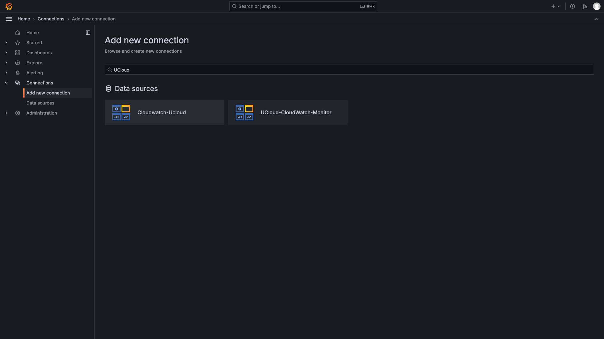
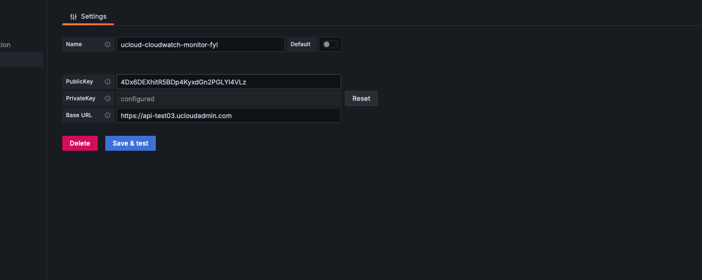
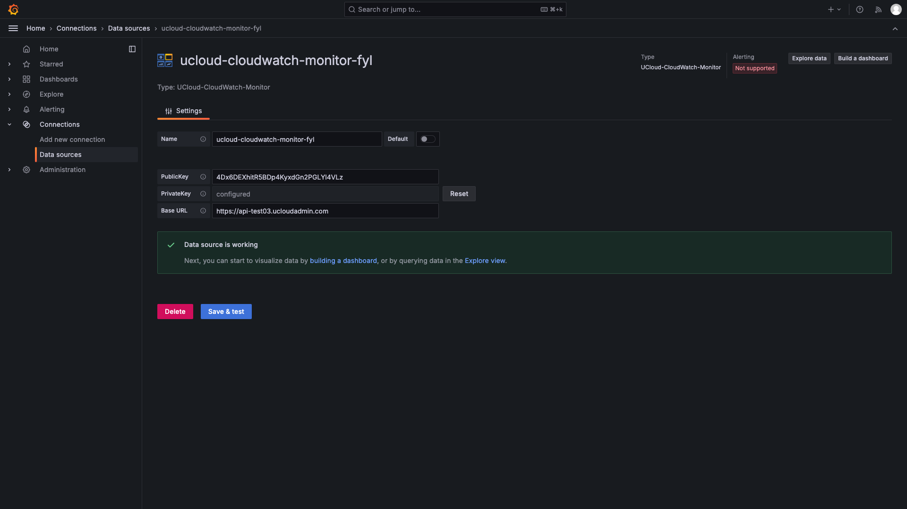
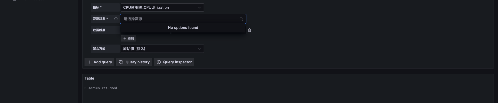
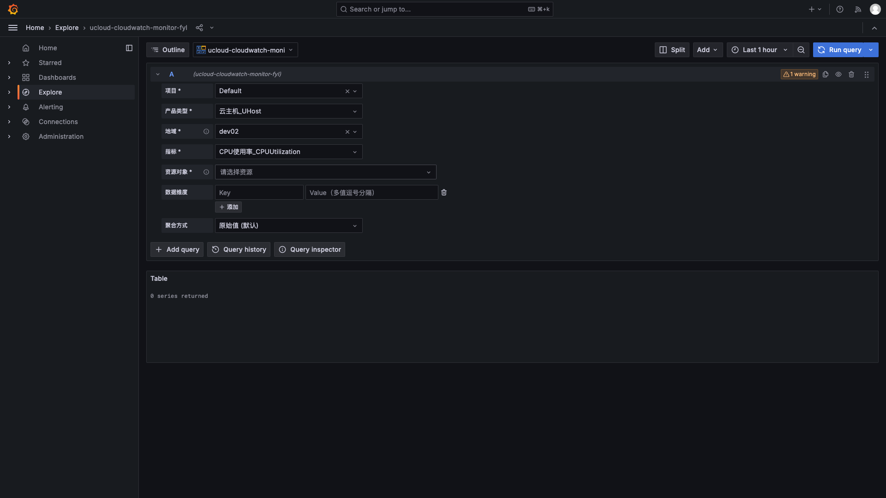

# CloudWatch Grafana 插件接入

## 功能概述

CloudWatch 提供 Grafana 数据源插件，支持将 UCloud 云监控数据接入您的 Grafana 平台。完成接入后，您可以在 Grafana 中直接查询和展示 CloudWatch 监控指标，并与 Prometheus、自建业务监控等多来源数据在同一 Dashboard 中统一呈现。

该插件支持按项目、产品类型、地域、资源对象等维度查询指标数据，支持 Grafana 模板变量实现动态切换，帮助您构建灵活、统一的监控可视化视图。

***

## 适用场景

- 已部署 Grafana 作为统一监控平台，需要接入 UCloud 云资源监控数据
- 需要将 CloudWatch 指标与 Prometheus、自建系统等多来源数据集中展示
- 需要基于 Grafana 灵活构建自定义监控大盘
- 希望减少多系统切换，提升运维观测效率

***

## 前置条件

开始接入前，请确认满足以下条件：

- 已开通 **CloudWatch 云监控服务**
- 已部署可用的 **Grafana** 实例（版本 ≥ 10.4.0，推荐 11.x / 12.x）
- 已在 [UCloud 控制台 - UAPI 密钥管理](https://console.ucloud.cn/uapi/apikey) 获取 **PublicKey** 与 **PrivateKey**
- Grafana 服务器可访问 UCloud OpenAPI（默认 `https://api.ucloud.cn`）

### 环境要求

| 项目 | 要求 |
|------|------|
| Grafana 版本 | ≥ 10.4.0（推荐 11.x / 12.x） |
| 操作系统 | Linux（amd64 / arm64）、macOS（amd64 / arm64）、Windows（amd64） |
| 网络 | Grafana 服务器可访问 `https://api.ucloud.cn` |

***

## 获取插件

| 项目 | 内容 |
|------|------|
| 插件名称 | `ucloud-cloudwatch-monitor` |
| 当前版本 | 1.0.0 |
| 下载地址 | <https://github.com/ucloud/cloudwatch-grafana-plugin-customer/releases/download/1.0.0/ucloud-cloudwatch-monitor-1.0.0.zip> |

下载完成后，请将安装包上传至 Grafana 所在服务器。

在 Grafana 的 **Connections → Add new connection** 页面搜索 `UCloud`，可以看到该插件：



***

## 安装插件

### 插件目录说明

| 部署方式 | 默认插件目录 |
|----------|-------------|
| 二进制安装 | `/var/lib/grafana/plugins` |
| Docker 部署 | 容器内 `/var/lib/grafana/plugins`（需通过 volume 挂载） |
| 自定义路径 | 查看 `grafana.ini` 中 `[paths] plugins=` 配置项 |

### 操作步骤

#### 1. 解压插件

```bash
unzip ucloud-cloudwatch-monitor-1.0.0.zip -d /var/lib/grafana/plugins/ucloud-cloudwatch-monitor
```

#### 2. 赋予后端二进制可执行权限

```bash
chmod +x /var/lib/grafana/plugins/ucloud-cloudwatch-monitor/gpx_ucloud_cloudwatch_*
```

#### 3. 允许加载未签名插件

编辑 Grafana 配置文件（默认 `/etc/grafana/grafana.ini`），添加以下内容：

```ini
[plugins]
allow_loading_unsigned_plugins = ucloud-cloudwatch-monitor
```

Docker 部署可通过环境变量设置：

```bash
GF_PLUGINS_ALLOW_LOADING_UNSIGNED_PLUGINS=ucloud-cloudwatch-monitor
```

#### 4. 重启 Grafana 服务

```bash
# systemd
systemctl restart grafana-server

# Docker
docker restart <grafana-container>
```

#### 5. 验证安装

```bash
# systemd
journalctl -u grafana-server -f | grep ucloud

# Docker
docker logs <grafana-container> 2>&1 | grep ucloud
```

日志中出现以下信息即表示安装成功：

- `Plugin registered`
- `Successfully started backend plugin process`

### 升级插件

```bash
systemctl stop grafana-server

rm -rf /var/lib/grafana/plugins/ucloud-cloudwatch-monitor
unzip ucloud-cloudwatch-monitor-<新版本>.zip -d /var/lib/grafana/plugins/ucloud-cloudwatch-monitor
chmod +x /var/lib/grafana/plugins/ucloud-cloudwatch-monitor/gpx_ucloud_cloudwatch_*

systemctl start grafana-server
```

!> 升级不会影响已有 Dashboard、数据源配置和 Panel 查询，无需重新配置。

!> 升级后请在浏览器执行强制刷新（Windows：`Ctrl + Shift + F5`，macOS：`Cmd + Shift + R`）以加载最新前端资源。

***

## 配置数据源

### 操作步骤

1. 登录 Grafana，在左侧菜单选择 **Connections → Add new connection**。
2. 搜索 `UCloud-CloudWatch-Monitor`，点击进入。
3. 点击 **Add new data source**。
4. 填写配置信息（见下表）。
5. 点击 **Save & Test** 验证连通性。

### 配置项说明

| 字段 | 必填 | 说明 |
|------|------|------|
| **PublicKey** | 是 | UCloud API 公钥 |
| **PrivateKey** | 是 | UCloud API 私钥，加密存储于 Grafana 服务端 |
| **Base URL** | 是 | UCloud OpenAPI 地址，默认 `https://api.ucloud.cn`；专有云请填写实际地址 |



### 连通性测试结果

点击 **Save & Test** 后，页面会显示测试结果：



| 返回信息 | 含义 |
|----------|------|
| `Data source is working` | 配置正确，连接成功 |
| `Invalid Credentials` | PublicKey 或 PrivateKey 错误 |
| `Permission Denied` | 密钥有效但账号权限不足 |
| `Network Error` | 网络不通，请检查 Base URL 或防火墙规则 |

***

## 查询监控数据

在 Dashboard 中新增或编辑 Panel，数据源选择 **UCloud-CloudWatch-Monitor**，按以下字段配置查询条件。

### 查询字段

| 字段 | 必填 | 说明 |
|------|------|------|
| **项目** | 是 | 下拉单选，展示当前账号有权限的项目列表；支持模板变量 |
| **产品类型** | 是 | 下拉单选，支持搜索（如 UHost、UDB、EIP 等） |
| **地域** | 是 | 下拉单选；全局产品（如 UCDN）自动隐藏此字段；支持模板变量 |
| **指标** | 是 | 下拉单选，支持搜索；根据所选产品类型自动过滤 |
| **资源对象** | 是 | 下拉多选，最多 **20** 个；需先选择项目、产品类型和地域 |
| **数据维度** | 否 | Key-Value 键值对，用于细粒度过滤；Value 支持多值逗号分隔 |
| **聚合方式** | 否 | 原始值（默认）/ 最大值 / 最小值 / 平均值 / 求和值 |



填齐所有必填项后，面板自动出图；修改任意字段后自动重新查询，无需手动触发。



### 数据粒度

插件根据 Grafana 时间范围自动选择数据周期：

| 时间范围 | 数据周期 |
|----------|----------|
| ≤ 1 小时 | 60 秒 |
| 1 小时 ~ 24 小时 | 5 分钟 |
| 1 天 ~ 30 天 | 1 小时 |
| > 30 天 | 1 天 |

***

## 模板变量

通过 Grafana 模板变量，您可以使用同一 Dashboard 动态切换项目、地域与资源，无需为每种组合重复创建面板。

### 创建方式

进入 **Dashboard → Settings → Variables → New variable**：

- **Type**：选择 `Query`
- **Data source**：选择 UCloud-CloudWatch-Monitor 实例
- **Query**：填写 JSON 配置（见下方示例）

### 配置示例

**项目变量（`$project`）：**

```json
{"type": "project"}
```

**地域变量（`$region`）：**

```json
{"type": "region", "params": {"product": "uhost"}}
```

**资源变量（`$resource`），支持联动：**

```json
{
  "type": "resource",
  "params": {
    "product": "uhost",
    "region": "${region}",
    "project": "${project}"
  }
}
```

### 联动说明

- 切换顶部 `$project` 或 `$region` 变量时，`$resource` 候选列表自动刷新，Panel 随之重新查询。
- Query 面板的下拉列表中，模板变量显示在选项顶部，可直接选择。
- 资源对象字段支持 Multi-value 变量，自动展开为多个资源 ID。

***

## 异常处理

| 场景 | Panel 表现 |
|------|------------|
| 必填项未填齐 | 显示警告，提示具体缺失字段 |
| 查询完全失败 | 面板左上角红色错误图标，附错误说明 |
| 部分资源查询失败 | 成功资源正常出图，同时显示黄色警告标注失败资源 |
| 无数据 | 图表区域显示 `No Data` |

***

## 常见问题（FAQ）

### 1. 出现 Plugin unavailable 错误

请依次排查：

1. 后端二进制架构是否与服务器匹配（`x86_64` → `linux_amd64`，`aarch64` → `linux_arm64`）。
2. 是否已在 `grafana.ini` 中配置 `allow_loading_unsigned_plugins = ucloud-cloudwatch-monitor`。
3. 后端二进制文件是否已赋予可执行权限。

### 2. 下拉列表为空

- 检查 PublicKey / PrivateKey 是否正确。
- 确认当前账号具有对应产品和项目的查询权限。
- 切换产品类型或项目后，下级字段会自动刷新，请稍候。

### 3. 资源对象最多选 20 个，能否调整？

不支持调整。该限制用于保障单次查询响应性能。如需展示更多资源，建议拆分为多个 Panel。

### 4. 升级插件后 Dashboard 会丢失吗？

不会。只要插件 ID 保持为 `ucloud-cloudwatch-monitor`，已有数据源配置、Dashboard 和 Panel 查询均会保留。

### 5. PrivateKey 存储是否安全？

安全。PrivateKey 通过 Grafana `secureJsonData` 机制加密存储于服务端，所有 API 请求由后端进程发起，不会暴露在浏览器网络请求中。

### 6. 模板变量未被替换

- 确认引用语法为 `${varname}` 或 `$varname`。
- 确认变量已在 **Dashboard Settings → Variables** 中定义。

***

## 相关文档
- [UCloud OpenAPI 文档](https://docs.ucloud.cn/api/)
- [UAPI 密钥管理](https://console.ucloud.cn/uapi/apikey)
- [Grafana 模板变量文档](https://grafana.com/docs/grafana/latest/dashboards/variables/)
