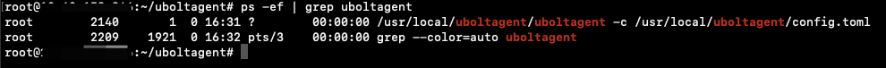
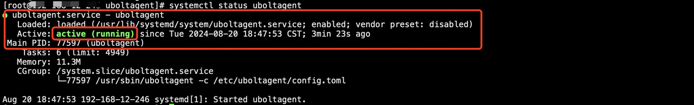
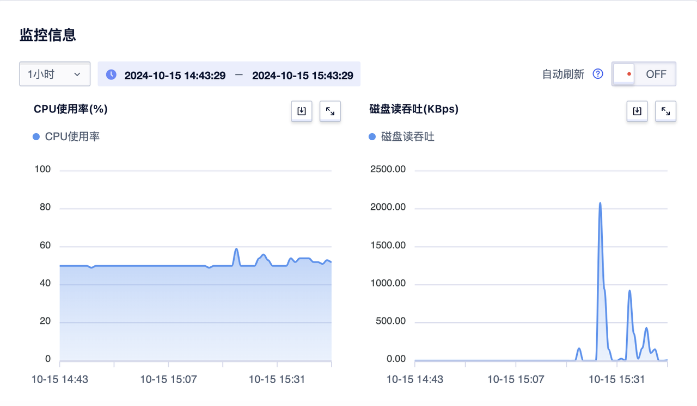
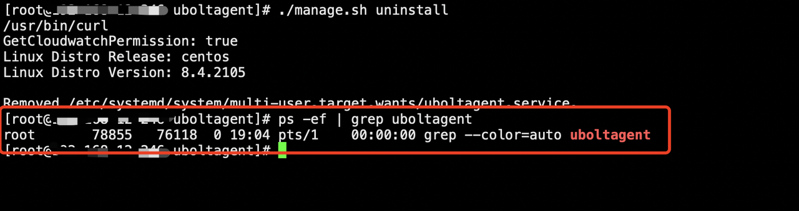

# UboltAgent Linux 安装手册

为确保用户能够通过 UCloud 云监控查看云服务器指标数据并产生告警，需在目标主机上部署官方监控 Agent。云服务器指标数据采集依赖于监控 Agent。

---

## 安装前须知

- 安装新版本 UboltAgent，会卸载历史 Python 版本 uma（如果已安装）。
- 获取 UboltAgent 安装包的命令需要在 UCloud 云主机中执行，否则无法正常下载。
- 为保证监控数据正常上报，云主机操作系统内部需放行TCP 协议的8088端口。
- 若 SELinux 为严格模式，请将 `/etc/selinux/config` 文件中的 `SELINUX=disabled`，并重启服务器以生效。
- CPU 云主机不同操作系统支持版本请参考 [镜像列表](cloudwatch/uboltagent/CPUHostImageList.md)。
- GPU 云主机支持机型请参考[机型列表](cloudwatch/uboltagent/GPUHostList.md)。
- 裸金属服务器支持机型请参考[机型列表](cloudwatch/uboltagent/GPUPHostList.md)。

---

## Linux 安装步骤

### 1.  以 root 用户登录云主机

安装过程需要使用 root 用户登录云主机。

---

### 2.  下载监控组件（以 wget 命令为例）

**amd64 架构：**

```bash
wget http://umon.api.service.ucloud.cn/static/cloudwatch/uboltagent-v1.0.2-linux-amd64.tar.gz
```

**arm64 架构：**

```bash
wget http://umon.api.service.ucloud.cn/static/cloudwatch/uboltagent-v1.0.2-linux-arm64.tar.gz
```

!> 注意：  
使用内网下载监控组件前，请先登录 Linux 实例执行命令，并确保云服务器使用内网 DNS，否则将无法解析下载地址。  
若未安装 `wget`，请先安装`wget`或使用 `curl` 命令下载。

**amd64架构:** 

```bash
curl -O http://umon.api.service.ucloud.cn/static/cloudwatch/uboltagent-v1.0.2-linux-amd64.tar.gz
```

**arm64架构:** 

```bash
curl -O http://umon.api.service.ucloud.cn/static/cloudwatch/uboltagent-v1.0.2-linux-arm64.tar.gz
```

---

### 3.  安装监控组件

#### 解压缩安装包

**amd64 架构：**

```bash
tar -zxf uboltagent-v1.0.2-linux-amd64.tar.gz
```

**arm64 架构：**

```bash
tar -zxf uboltagent-v1.0.2-linux-arm64.tar.gz
```

#### 进入安装目录并授权脚本权限

```bash
cd uboltagent
chmod a+x manage.sh
```

#### 执行安装脚本

```bash
./manage.sh install
```

> 安装过程中若出现错误，可查看日志文件：  
> `/var/log/uboltagent_install.log`

---

### 4.  验证安装状态

#### 查看进程是否启动

执行命令如下：

```bash
ps -ef | grep uboltagent
```

若执行结果如下图所示，说明 UboltAgent 相关进程已正常启动，则已经成功安装 UboltAgent



#### 查看服务状态

执行命令如下：

```bash
service uboltagent status
# 或者
systemctl status uboltagent
```

若执行结果如下图所示，说明 UboltAgent 服务状态正常



#### 登录云监控确认

等待约5分钟，进入云监控 CloudWatch->产品监控->点击资源详情，查看相关指标图表数据是否正常展示



---

## Linux 卸载

1. 执行以下命令进行卸载：

```bash
./manage.sh uninstall
```

2. 执行以下命令确认进程是否停止：

```bash
ps -ef | grep uboltagent
```

若无相关进程，说明已卸载成功。



---

## 注意事项

1. 防火墙和安全组：确保防火墙和安全组设置允许云主机访问监控服务器的地址。
2. UboltAgent 版本兼容性：确保下载的UboltAgent版本与您的云主机操作系统版本兼容。
3. 定期升级更新：建议定期检查并升级 UboltAgent，以获得最新功能与安全补丁。
4. 遇到问题：如果在安装过程中遇到问题，可通过安装日志查看详细信息或者联系技术支持。
