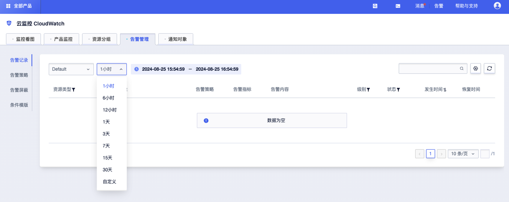
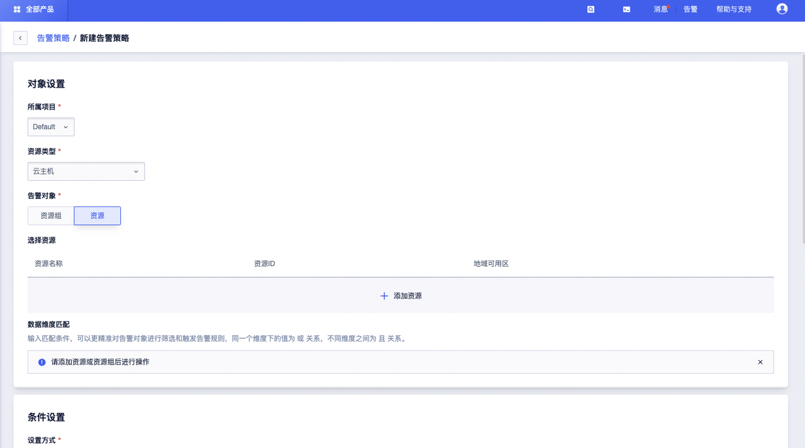
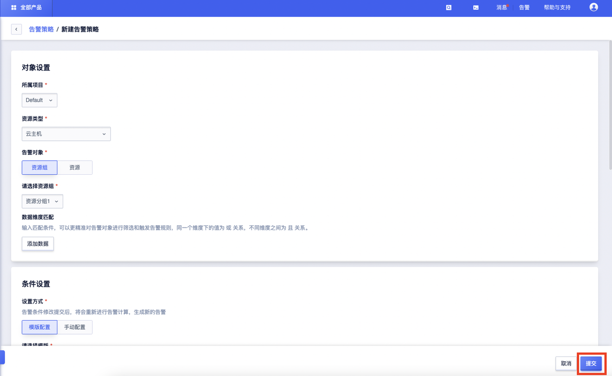
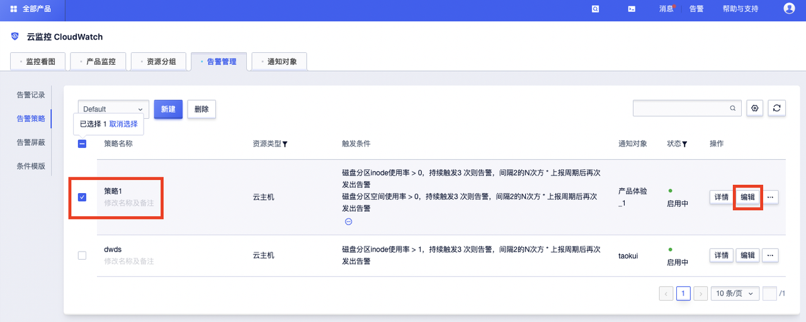
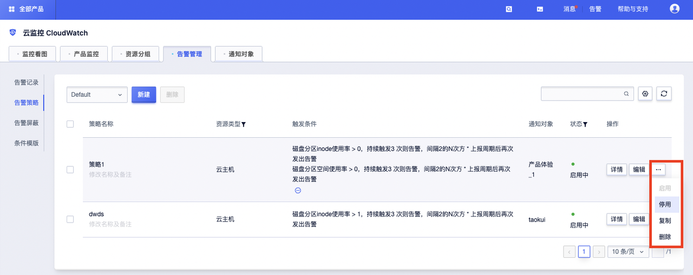
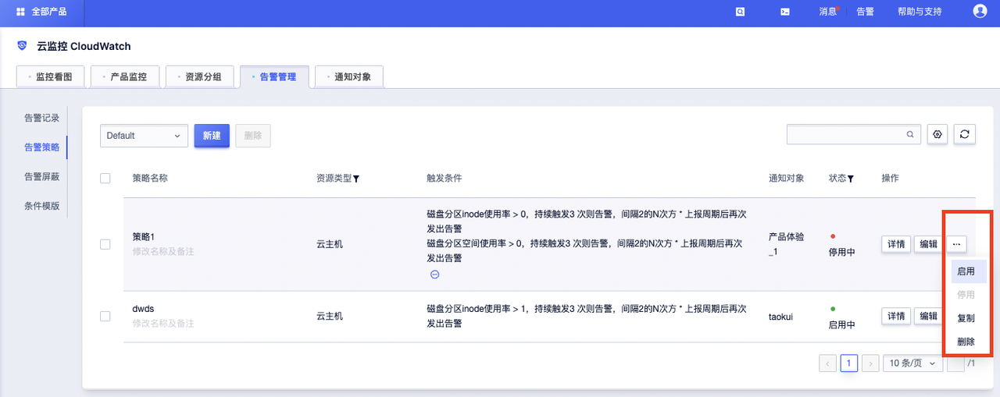
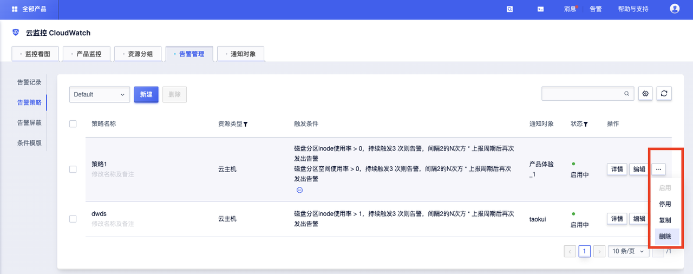
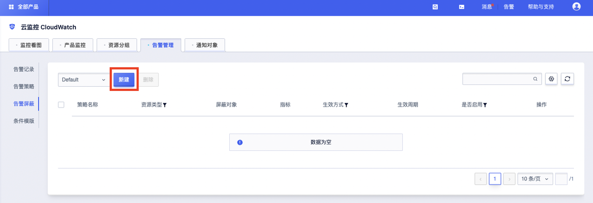
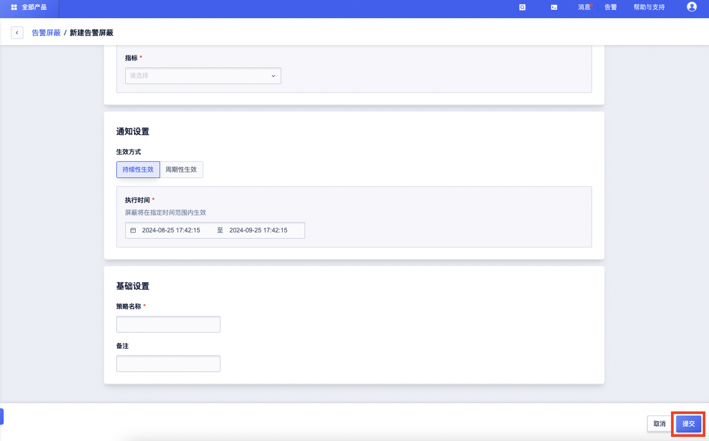
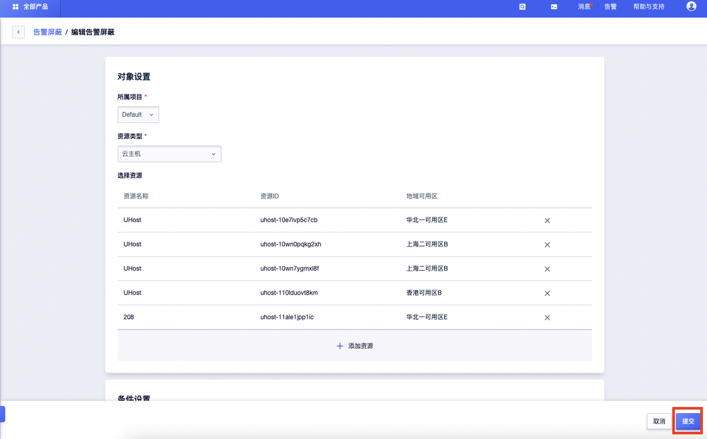

# 告警管理

## 查看告警记录
### 功能描述
告警历史可以展示自定义时间范围内所有告警规则的状态变化，您可以统一、方便地回溯和查看告警记录。

### 操作步骤
1. 登录UCloud控制台-资源监控
2. 在顶部导航栏选择告警管理  > 告警记录，进入告警记录列表页。
3. 在告警记录页面，用户可以选择项目，并自定义时间范围，默认为最近1小时。

## 新建告警策略

### 功能描述
云监控支持灵活的创建告警策略。用户可以针对云产品支持的监控指标设置阈值告警，在发生异常时及时通知用户采取措施。告警策略包括名称、策略类型和告警触发条件、告警对象、告警通知配置五个必要组成部分。

### 操作步骤
1. 登录UCloud控制台-资源监控
2. 在顶部导航栏选择告警管理  > 告警策略，进入告警策略列表页。
3. 在告警策略页面，选择项目，单击新建，创建告警策略。
   

4. 在新建告警策略页面，根据界面提示配置参数。

5. 配置参数如下：

| 参数                   | 参数说明                                                     | 备注                                                   |
| :--------------------- | :----------------------------------------------------------- | :----------------------------------------------------- |
| 所属项目*              | 用户的项目列表                                               |                                                        |
| 资源类型*              | 接入云监控的产品类型                                         |                                                        |
| 告警对象*              | 资源或资源组，二选一，默认为指定资源组                       |                                                        |
| 选择资源               | 选择指定资源类型下的资源对象                                 |                                                        |
| 数据维度匹配           | 数据维度 = 指标 + 标签（Tag），帮助您设置更细粒度的告警规则  | 同一个维度下的值为 或 关系，不同维度之间为 且 关系。   |
| 设置方式*              | 支持选择模版配置或者手动配置，二选一，默认为模版配置         | 告警条件修改提交后，将会重新进行告警计算，生成新的告警 |
| 模板配置 > 请选择模版* | 选择默认模板或创建条件模板，推荐使用模板，后续可避免重复配置 |                                                        |
| 手动配置 > 告警条件    | 满足以下任意指标判断条件时，触发告警                         |                                                        |
| 通知方式*              | 配置告警通知的通知方式，支持邮件/短信/接口回调               |                                                        |
| 接收对象*              | 配置接收告警通知的接收对象，支持通知组/通知人                |                                                        |
| 策略名称*              | 自定义输入                                                   |                                                        |

6. 在新建告警策略页面右下角，点击提交，完成告警策略创建。

## 编辑告警策略

### 功能描述
当您业务发生变更或告警策略已经不能满足当前业务，您可以编辑该告警策略。

### 操作步骤
1. 登录UCloud控制台-资源监控
2. 在顶部导航栏选择告警管理  > 告警策略，进入告警策略列表页。
3. 在告警策略页面，选择项目，勾选需要修改的告警策略，单击编辑。

4. 在编辑告警策略页面，根据界面提示修改参数。
5. 在编辑告警策略页面右下角，点击提交，完成告警策略编辑。

## 停用告警策略

### 功能描述
当您的告警策略临时需要停用时，您可以在告警策略列表页停用此告警策略。

### 操作步骤
1. 登录UCloud控制台-资源监控
2. 在顶部导航栏选择告警管理  > 告警策略，进入告警策略列表页。
3. 在告警策略页面，选择项目，勾选需要停用的告警策略，单击更多  > 停用，停用该告警策略。

4. 在需要重新启用该告警策略时，点击更多  > 启用，重新启用该告警策略。

## 删除告警策略

### 功能描述
当您业务发生变更或告警策略不需要使用时，您可以删除该告警策略。

### 操作步骤
1. 登录UCloud控制台-资源监控
2. 在顶部导航栏选择告警管理  > 告警策略，进入告警策略列表页。
3. 在告警策略页面，选择项目，勾选需要删除的告警策略，单击更多  > 删除，删除该告警策略。

## 新建告警屏蔽

### 功能描述
当用户需要对已创建的告警进行屏蔽时，可以新建告警屏蔽。

### 操作步骤
1. 登录UCloud控制台-资源监控
2. 在顶部导航栏选择告警管理  > 告警屏蔽，进入告警屏蔽列表页。
3. 在告警屏蔽页面，选择项目，单击新建创建告警屏蔽。

4. 在新建告警屏蔽页面，根据界面提示配置参数。
5. 配置参数如下：

| 参数        | 参数说明                     |
|:------------|:-----------------------------|
| 所属项目*   | 用户的项目列表               |
| 资源类型*   | 接入云监控的产品列表         |
| 选择资源    | 选择指定资源类型下的资源对象 |
| 屏蔽指标*   | 支持选择全部指标或特定指标   |
| 生效方式*   | 持续性生效或周期性生效       |
| 执行时间*   | 屏蔽将在指定时间范围内生效   |
| 策略名称*   | 自定义输入                   |

6. 在新建告警屏蔽页面右下角，点击提交，完成告警屏蔽创建。 

## 编辑告警屏蔽

### 功能描述
当您业务发生变更或告警屏蔽已经不能满足当前业务，您可以编辑该告警屏蔽。

### 操作步骤
1. 登录UCloud控制台-资源监控
2. 在顶部导航栏选择告警管理  > 告警屏蔽，进入告警屏蔽列表页。
3. 在告警屏蔽页面，选择项目，勾选需要修改的告警屏蔽策略，单击编辑。

4. 在编辑告警屏蔽页面，根据界面提示修改参数。
5. 在编辑告警屏蔽页面右下角，点击提交，完成告警屏蔽修改。

## 删除告警屏蔽

### 功能描述
当您业务发生变更或告警屏蔽不需要使用时，您可以删除该告警屏蔽。

### 操作步骤
1. 登录UCloud控制台-资源监控
2. 在顶部导航栏选择告警管理  > 告警屏蔽，进入告警屏蔽列表页。
3. 在告警屏蔽页面，选择项目，勾选需要修改的告警屏蔽策略，单击更多  > 删除，删除该告警屏蔽。

