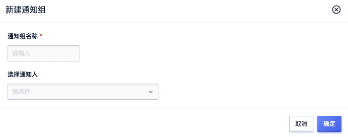

# 通知人管理
## 创建通知人

### 功能描述
通知人能够接收告警通知，方便您快速处理告警问题。

### 操作步骤
1. 登录UCloud控制台-资源监控
2. 在顶部导航栏选择通知对象  > 通知人，进入通知人列表页。
3. 在通知人页面，单击新建创建通知人。

5. 根据弹框页面提示输入通知人的姓名、手机号、邮箱。所创建的通知人的邮箱及手机号，默认处于等待激活状态。需要根据短信及邮箱相应激活码进行激活。

7. 单击确定按钮，完成通知人的创建。

## 修改通知人信息

### 功能描述
当通知人的联系方式发生变化时，需要及时修改通知人的联系方式。

### 操作步骤
1. 登录UCloud控制台-资源监控
2. 在顶部导航栏选择通知对象  > 通知人，进入通知人列表页。
3. 在通知人页面，选择需要修改信息的通知人，单击编辑。
4. 在弹框页面修改通知人信息。
5. 单击确定按钮，完成通知人信息的修改。

## 删除通知人

### 功能描述
当该通知人不需要再使用时，您可以在控制台进行删除操作。

### 操作步骤
1. 登录UCloud控制台-资源监控
2. 在顶部导航栏选择通知对象  > 通知人，进入通知人列表页。
3. 在通知人页面，选择需要删除信息的通知人，单击删除。
4. 在弹框页面确认需要删除的通知人信息，单击确定，完成通知人的删除。

## 创建通知组

### 功能描述
告警通知将发送给对应通知组中的通知人，因此需要设置通知组。

### 操作步骤
1. 登录UCloud控制台-资源监控
2. 在顶部导航栏选择通知对象  > 通知组，进入通知组列表页。
3. 在通知组页面，单击新建创建通知组。

4. 根据弹框页面提示输入通知组名称，并选择通知人。

5. 单击确定按钮，完成通知组的创建。

## 修改通知组

### 功能描述
当通知组的名称、组内通知人需要发生改变时，您可以在通知组页面进行修改。

### 操作步骤
1. 登录UCloud控制台-资源监控
2. 在顶部导航栏选择通知对象  > 通知组，进入通知组列表页。
3. 在通知组页面，选择需要发生改变的通知组，单机操作栏详情，进入通知人管理页面。
4. 在编辑通知组页面，根据页面提示进行修改。
- 在编辑通知组 > 基础信息模块，可以修改通知组名称
- 在编辑通知组 > 通知人模块，可以添加或移出通知人

## 删除通知组

### 功能描述
当通知组不需要使用时，您可以在控制台进行删除。

### 操作步骤
1. 登录UCloud控制台-资源监控
2. 在顶部导航栏选择通知对象  > 通知组，进入通知组列表页。
3. 在通知组页面，选择需要删除信息的通知组，单击删除。
4. 在弹框页面确认需要删除的通知人信息，单击确定，完成通知组的删除。
