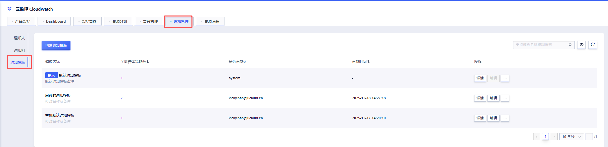
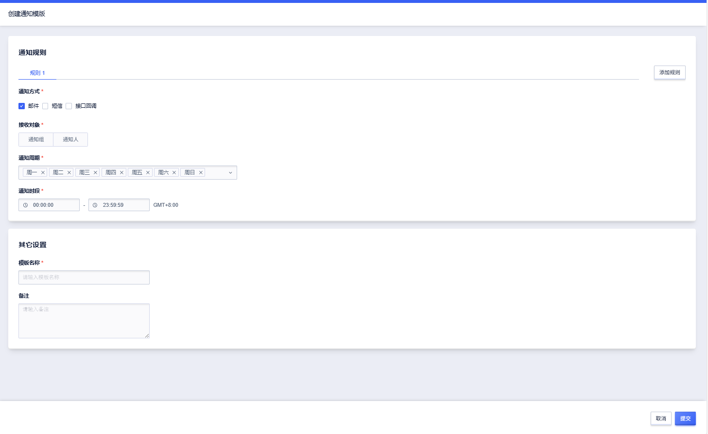
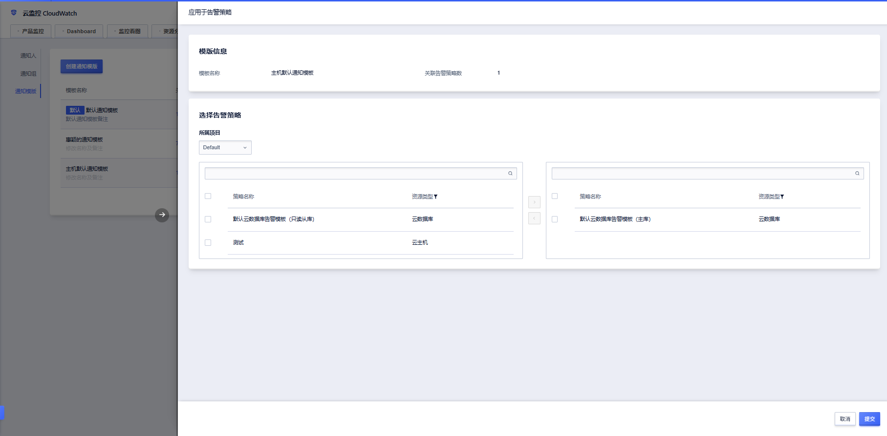
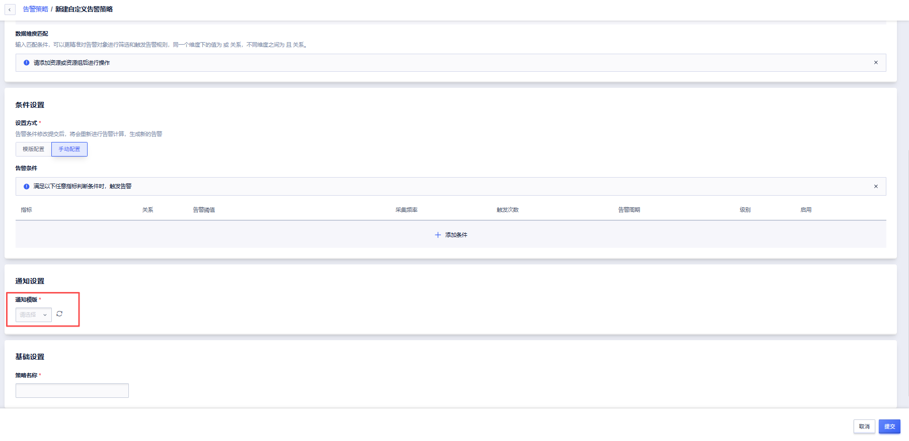
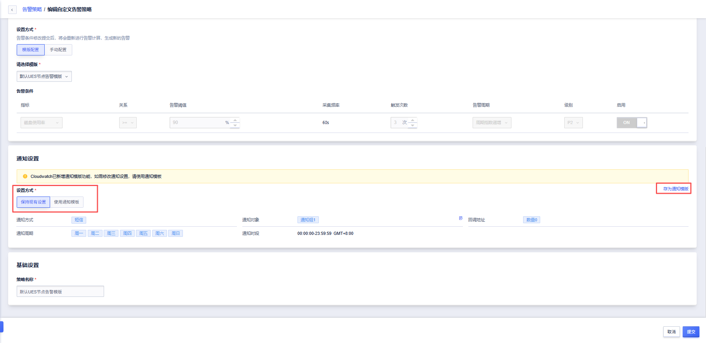

# 通知模板

## 功能概述

告警通知模板用于统一配置告警通知的发送方式、接收对象及生效时间规则，并可在多个告警策略中复用，帮助您减少重复配置、提升告警管理效率。

------

## 核心功能与亮点

- **通知模板化管理**   
  将告警通知配置抽象为模板，可在多个告警策略中复用，避免重复配置。

- **通知周期与时段精细控制**  
  支持按周循环，可自定义设置一天内具体允许接收告警通知的时间段 ，减少非业务时段的无效打扰。

- **多套通知规则灵活组合**   
  单个通知模板内支持配置最多 5 套通知规则，每套规则独立生效，可分别设置不同的通知方式、接收对象、通知周期与时段。

- **批量应用告警策略**  
  一个通知模板可一键应用到多个告警策略，适合统一调整告警通知规则的场景。

------

## 典型使用场景

### 场景一：工作日业务告警统一通知

适用于仅在工作日需要关注业务状态的场景。    
通过创建通知模板并设置 **通知周期为工作日（周一至周五）**、**通知时段为 09:00–18:00**，即可将该模板统一应用到多个业务告警策略中。

### 场景二：晚高峰或夜间重点监控

适用于业务在白天与夜间关注重点不同的场景，用户可在同一通知模板中配置两套规则： 

- 白天规则：09:00–18:00，仅通过接口回调通知；  
- 夜间规则：18:00–09:00，通过短信通知；  

实现不同时间段差异化告警。

### 场景三：企业统一告警规范管理

适用于多项目、多团队的企业用户。   
管理员可预先创建标准化通知模板（如“生产环境告警模板”、“测试环境告警模板”），并批量应用到不同项目的告警策略中，实现统一告警规范。

------

## 前置条件

在开始使用告警通知模板前，请确认：       

- 已开通 **CloudWatch 云监控服务**

- 当前账号具备 **告警管理 / 通知管理** 操作权限

- 如需使用通知组，已提前创建 **通知人 / 通知组**

------

## 创建告警通知模板

### 操作入口

[CloudWatch 控制台](https://console.ucloud.cn/umonitor/alarmContact?tab=template) → 通知管理 → 通知模板 → + 创建通知模板

### 操作步骤

1. **进入创建页面**：点击 `「+ 创建通知模板」`。   
   
2. **选择通知方式**   
   支持 邮件 / 短信 / 接口回调。
3. **配置接收对象 **  
   选择 通知人 或 通知组，并从列表中选择目标对象。
4. **设置通知周期 **  
   选择告警生效的星期，或使用快捷选项 每天 / 工作日 / 周末。
5. **设置通知时段**   
   选择开始时间与结束时间（24 小时制），支持设置跨日的时段。
6. **填写基础信息 **  
   输入 模板名称（必填），可填写 备注（选填）。
7. **提交创建**   
   点击 **「提交」**，成功创建通知模板。

------

## 管理通知模板

- **详情**：查看模板完整配置  

- **编辑**：修改模板配置（默认模板不可编辑）  

- **复制**：基于现有模板快速创建新模板  

- **删除**：未被告警策略引用的模板才可删除  

- **应用于告警策略**：批量应用到指定项目的告警策略

  

------

## 在告警策略中使用通知模板

### 新建告警策略

1. 进入 **告警管理 → 告警策略 → 创建告警策略**

2. 在通知设置中选择 **通知模板**

   

3. 选择目标模板并提交

### 编辑存量告警策略

- 原有手动配置仅做展示，支持快速保存为通知模板

  

- 切换为模板配置后，仅支持通过通知模板管理通知规则

------

## 常见问题（FAQ）

### 1. 为什么无法删除某个通知模板？

**原因**：该模板已被一个或多个告警策略引用。

**解决建议**：先将相关告警策略切换为其他通知模板，再尝试删除。

### 2. 默认通知模板可以编辑或删除吗？

❌不可以。

**说明**：默认通知模板为系统内置模板，用于保证基础告警能力，暂不支持编辑和删除。

### 3. 修改通知模板后，会影响已有告警策略吗？

✅会。

**说明：**

- 通知模板被告警策略引用时，修改并保存模板后，所有关联的告警策略将同步生效。
- 系统会在保存前进行二次确认提示。