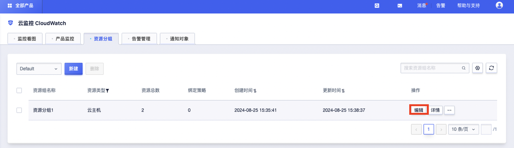

# 资源管理

## 创建资源分组
### 功能描述
您可以通过创建资源分组，将不同类型的产品加入同一组中统一管理。
### 操作步骤
1. 登录UCloud控制台-资源监控
2. 在顶部导航栏选择资源分组 ，进入资源分组列表页。
3. 在资源分组页面，选择项目，单击新建，创建资源分组。

4. 在创建资源组界面，根据界面提示配置参数。
5. 完成参数配置后，在创建资源组界面右下角，点击确定，完成资源分组创建。

6. 在资源分组列表页会展现已经创建好的资源组，点击详情可以查看资源组概览及告警记录。

## 复制资源分组

### 功能描述
您可以根据实际需要，利用已创建的资源组，在资源分组页面快捷复制资源组。

### 操作步骤
1. 登录UCloud控制台-资源监控
2. 在顶部导航栏选择资源分组 ，进入资源分组列表页。
3. 在资源分组页面，选择需要修改的资源组，单击更多 > 复制。

4. 完成资源组复制。

## 修改资源分组

### 功能描述
当您的资源组需要修改名称及资源时，可以在资源分组列表页，选择需要修改的资源组进行编辑。

### 操作步骤
1. 登录UCloud控制台-资源监控
2. 在顶部导航栏选择资源分组 ，进入资源分组列表页。
3. 在资源分组页面，选择需要修改的资源组，单击编辑。
   

4. 进入编辑资源组界面，可以修改资源组名称及资源组内对应资源，可以删除资源或添加资源。

5. 完成参数修改后，在编辑资源组界面右下角，点击确定，完成资源分组修改。

## 删除资源分组

### 功能描述
当资源分组不需要使用时，您可以在资源分组页面进行删除。

### 操作步骤
1. 登录UCloud控制台-资源监控
2. 在顶部导航栏选择资源分组 ，进入资源分组列表页。
3. 在资源分组页面，选择需要修改的资源组，单击更多 > 删除。

4. 点击确定，完成资源组删除。

