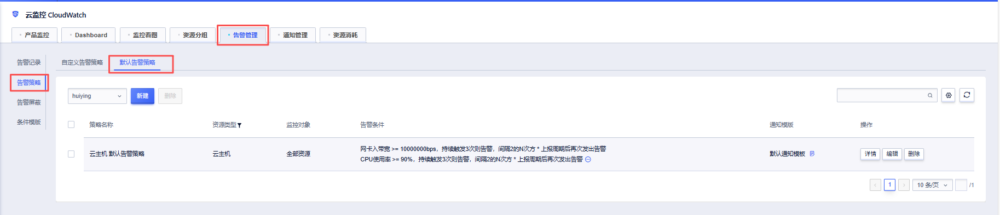
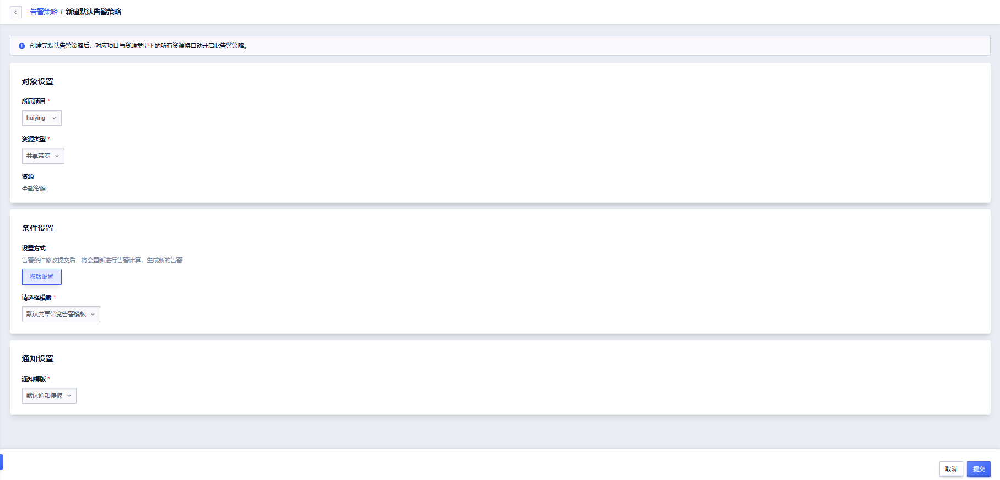

# 一键告警

## 功能介绍

 CloudWatch 新增一键告警能力，支持基于系统预置条件模板快速创建默认告警策略，帮助用户一键为指定云产品开启基础监控告警，自动覆盖当前及后续新增的所有实例，降低配置门槛，避免告警遗漏。

------

## 前置条件

在使用一键告警功能前，请确认已满足以下条件：

- 已开通 **CloudWatch 云监控服务**
- 当前账号拥有目标 **项目的相关权限**
- 项目中存在支持一键告警的资源类型（如云主机、外网弹性IP 等）

------

## 创建默认告警策略

### 功能入口

[CloudWatch控制台](https://console.ucloud.cn/umonitor/alarmManagement/alarmPolicy?tab=alarmOneClickPolicy) → 告警管理 → 告警策略

------

### 操作步骤

1. 进入创建页面：点击「新建」

   

2. 在弹出的配置窗口中，按顺序完成以下配置：

   - **所属项目**   
     选择需要启用一键告警的项目，策略将仅作用于所选项目；
   - **资源类型**   
     选择资源类型（仅可选择支持一键告警且未配置的资源类型）；
   - **资源**   
     平台自动覆盖存量资源及后续新增的所有资源；
   - **选择模板**   
     系统自动加载该资源类型的条件模板（默认选中该产品内置的条件模板）；
   - **通知模板**   
     选择通知模板（默认选中“默认通知模板”）

3. 提交创建
   - 点击「提交」，弹出二次确认提示，说明策略将应用于该项目下该资源类型的**全部实例**
   - 确认后，系统创建并自动启用默认告警策略

------

### 管理默认告警策略

- **详情**：查看指定策略的完整信息
- **编辑**：调整条件模板或通知模板
- **删除**：删除后存量及新增资源均不会自动关联告警策略

------

## 常见问题与解决建议（FAQ）

### Q1：一个资源类型可以创建多个默认告警策略吗？

❌不可以。   
**每个项目下的同一资源类型仅允许存在一条默认告警策略**，如已存在，将无法再次创建。

------

### Q2：创建默认告警策略后，新创建的实例是否需要手动绑定？

不需要。   
创建默认告警策略后，**新创建的实例会自动关联默认告警策略**，无需额外配置。

------

### Q3：可以修改已创建的默认告警策略吗？

✔可以。   
你可以在告警策略列表中点击 **编辑**，调整 **条件模板** 或 **通知模板**，修改后将对所有实例生效。